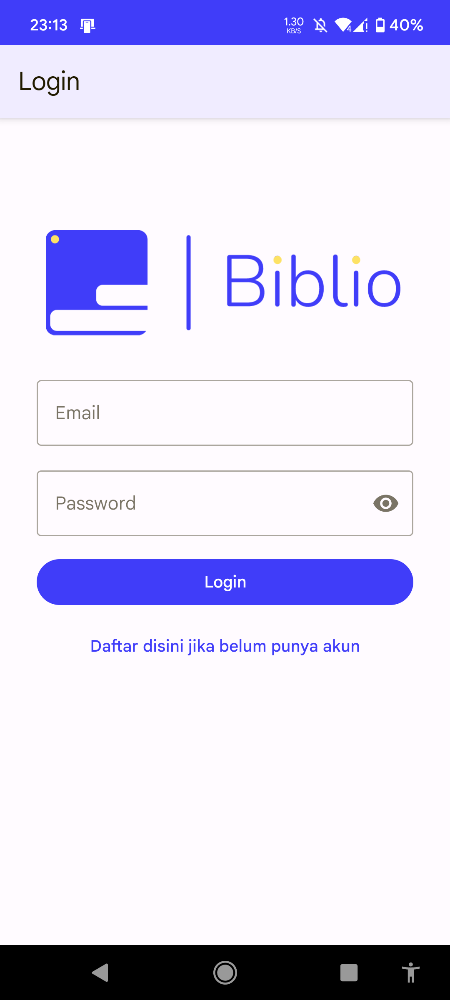
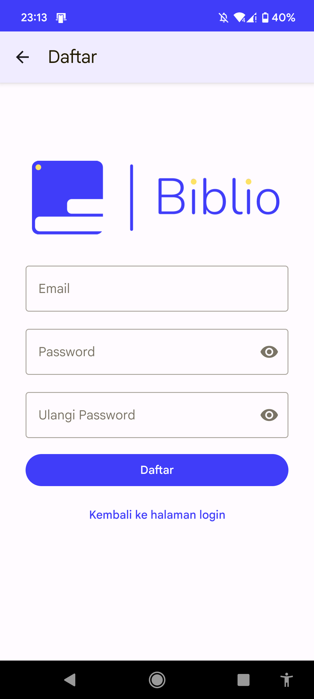
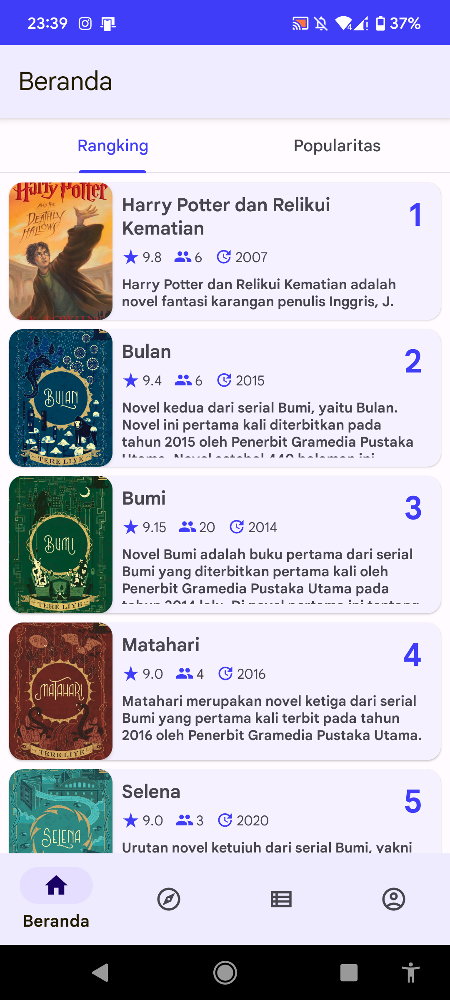
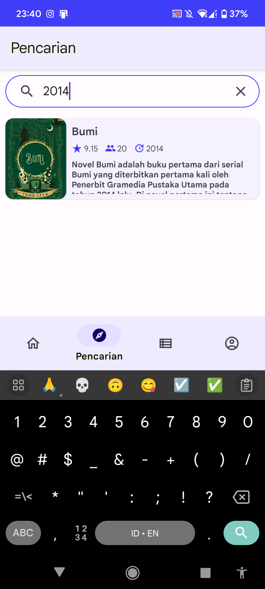
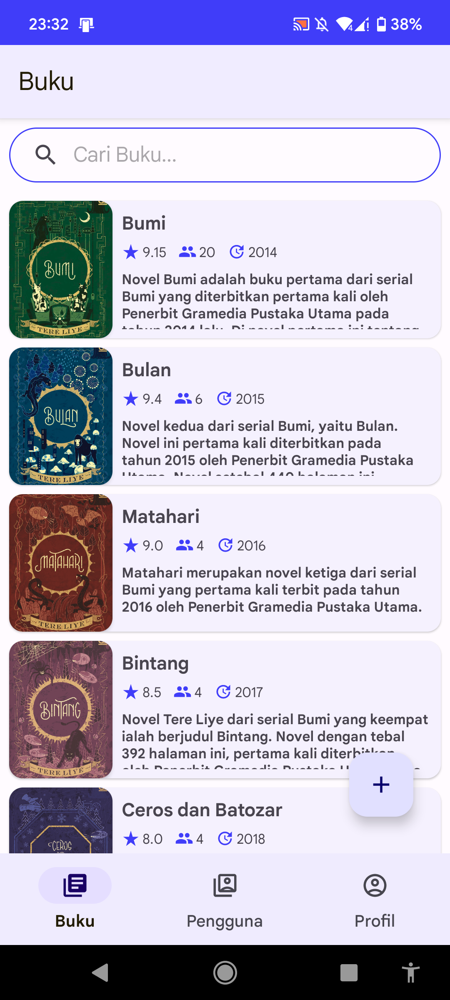
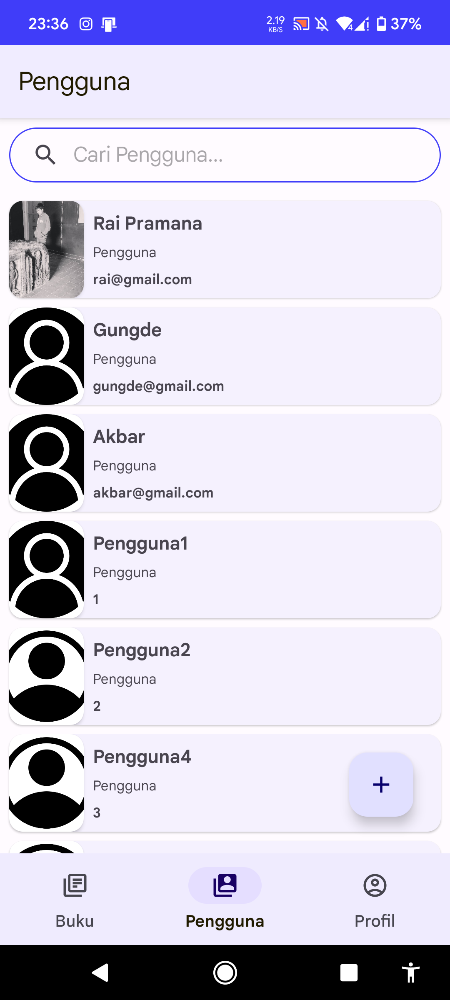

# Biblio - Aplikasi Review Buku Online


**Biblio** adalah aplikasi mobile Android untuk review dan manajemen buku online yang dikembangkan sebagai tugas Pemrograman Mobile D oleh Kelompok 8. Aplikasi ini memungkinkan pengguna untuk mengeksplorasi, meninjau, dan mengelola koleksi buku pribadi mereka dengan antarmuka yang user-friendly.

## 📱 Fitur Utama

### 👤 Fitur Pengguna

-   **Registrasi dan Login** - Sistem autentikasi pengguna yang aman
-   **Beranda** - Tampilan utama dengan rekomendasi buku
-   **Pencarian Buku** - Fitur pencarian untuk menemukan buku favorit
-   **Detail Buku** - Informasi lengkap tentang buku termasuk sinopsis dan rating
-   **Review dan Rating** - Memberikan ulasan dan penilaian pada buku
-   **My List** - Manajemen koleksi pribadi dengan kategori:
    -   📖 **Sedang Dibaca** - Buku yang sedang dibaca
    -   ⭐ **Favorit** - Buku favorit pengguna
    -   ✅ **Selesai Dibaca** - Buku yang telah selesai dibaca
-   **Profil Pengguna** - Manajemen informasi akun pengguna
-   **Dark Theme** - Mode gelap untuk kenyamanan mata

### 👨‍💼 Fitur Administrator

-   **Manajemen Buku** - CRUD (Create, Read, Update, Delete) data buku
-   **Manajemen Pengguna** - Kelola data pengguna aplikasi
-   **Dashboard Admin** - Panel kontrol untuk administrator
-   **Laporan Review** - Melihat semua review yang diberikan pengguna

## 🛠️ Teknologi & Library

### Platform

-   **Android SDK** (API Level 29-33)
-   **Java** - Bahasa pemrograman utama
-   **Gradle** - Build system

### Core Libraries

-   **AndroidX AppCompat** (1.6.1) - Kompatibilitas backward
-   **Material Design Components** (1.8.0) - UI components modern
-   **ConstraintLayout** (2.1.4) - Layout fleksibel
-   **RecyclerView** - Untuk tampilan list yang efisien
-   **CardView** - UI components untuk card layout

### Architecture Components

-   **Lifecycle** (2.6.1) - LiveData dan ViewModel
-   **Navigation Component** (2.5.3) - Navigasi antar fragment
-   **ViewBinding** - Binding view yang type-safe

### Database

-   **SQLite** - Database lokal untuk penyimpanan data
-   **DatabaseHelper** - Custom database management

### Additional Features

-   **SplashScreen** (1.0.0) - Splash screen native Android 12+
-   **Image Handling** - Upload dan preview gambar buku
-   **Session Management** - Manajemen sesi pengguna
-   **Search Functionality** - Pencarian real-time

## 📸 Screenshot Aplikasi

### Autentikasi

| Login                                                     | Registrasi                                                         |
| --------------------------------------------------------- | ------------------------------------------------------------------ |
|  |  |

### Fitur Pengguna

| Beranda                                                                       | Pencarian                                                                         | Detail Buku                                                                      |
| ----------------------------------------------------------------------------- | --------------------------------------------------------------------------------- | -------------------------------------------------------------------------------- |
|  |  |  |

### My List

| Favorit                                                                               | Sedang Dibaca                                                                               | Selesai Dibaca                                                                 |
| ------------------------------------------------------------------------------------- | ------------------------------------------------------------------------------------------- | ------------------------------------------------------------------------------ |
|  |  |  |

### Fitur Admin

| Dashboard Admin                                                | Manajemen Buku                                                                       | Manajemen Pengguna                                                           |
| -------------------------------------------------------------- | ------------------------------------------------------------------------------------ | ---------------------------------------------------------------------------- |
|  |  |  |

### Dark Theme

| Dark Mode                                                             | Dark Detail                                                            |
| --------------------------------------------------------------------- | ---------------------------------------------------------------------- |
|  |  |

## 🚀 Cara Menjalankan Aplikasi

### Prasyarat

-   Android Studio (versi terbaru)
-   Java Development Kit (JDK) 8 atau lebih tinggi
-   Android SDK dengan API Level 29-33
-   Device atau emulator Android

### Langkah Instalasi

1. **Clone Repository**

    ```bash
    git clone https://github.com/rai-pramana/Biblio.git
    cd Biblio
    ```

2. **Buka di Android Studio**

    - Pilih "Open an existing Android Studio project"
    - Navigate ke folder project yang sudah di-clone

3. **Sync Project**

    - Android Studio akan otomatis melakukan sync Gradle
    - Tunggu hingga proses selesai

4. **Build & Run**
    - Pilih device/emulator target
    - Klik tombol "Run" atau tekan `Shift + F10`

### Build APK

```bash
./gradlew assembleDebug
```

APK akan tersedia di `app/build/outputs/apk/debug/`

## 📁 Struktur Project

```
app/
├── src/main/
│   ├── java/com/progmob_d_kelompok_8/biblio/
│   │   ├── admin/              # Fitur administrator
│   │   ├── adminuser/          # Fitur bersama admin-user
│   │   ├── user/               # Fitur pengguna
│   │   ├── database/           # Database helper
│   │   ├── model/              # Data models
│   │   └── tool/               # Utilities & adapters
│   ├── res/                    # Resources (layout, drawable, values)
│   └── AndroidManifest.xml
├── build.gradle                # Dependencies & build config
└── proguard-rules.pro         # ProGuard configuration
```

## 🏗️ Arsitektur Aplikasi

Aplikasi menggunakan arsitektur **MVP (Model-View-Presenter)** dengan komponen:

-   **Model**: Database entities dan data management
-   **View**: Activities dan Fragments untuk UI
-   **Presenter**: Business logic dan data binding
-   **Database**: SQLite dengan DatabaseHelper untuk data persistence
-   **Session**: Manajemen state dan user session

## 📱 Minimum Requirements

-   **Android Version**: Android 10 (API Level 29)
-   **Target SDK**: API Level 33
-   **RAM**: Minimum 2GB
-   **Storage**: 50MB space available
-   **Permissions**:
    -   Read/Write External Storage (untuk gambar)
    -   Internet (untuk future features)

## 👥 Tim Pengembang

**Kelompok 8 - Pemrograman Mobile D**

-   Kontributor utama dan maintainer project
-   Pengembangan fitur core dan UI/UX
-   Testing dan quality assurance

## 📄 Lisensi

Project ini dikembangkan untuk keperluan akademik dalam mata kuliah Pemrograman Mobile D.

## 🔮 Future Development

-   [ ] Implementasi backend API
-   [ ] Sinkronisasi cloud
-   [ ] Social features (follow users, share reviews)
-   [ ] Push notifications
-   [ ] Barcode scanner untuk menambah buku
-   [ ] Export data ke PDF

---

**Developed with ❤️ by Kelompok 8**
